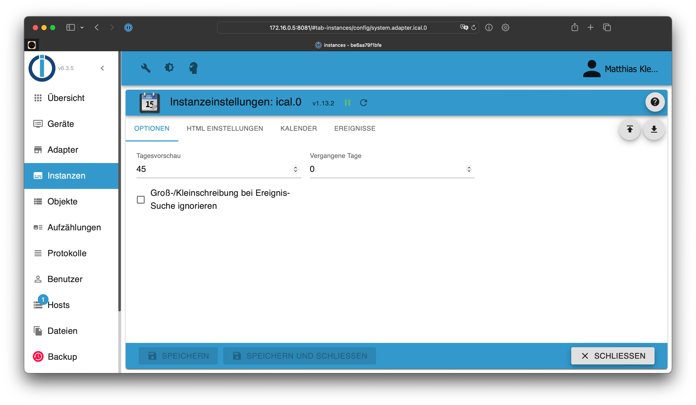
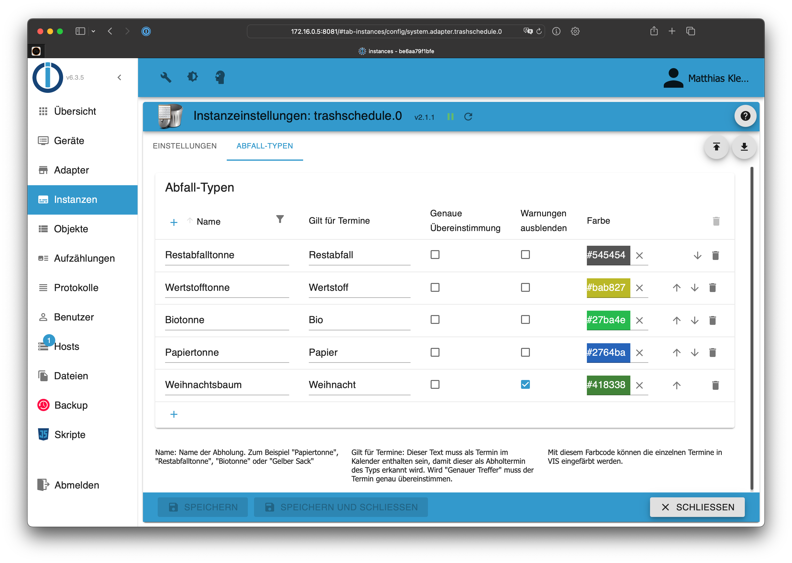

# ioBroker.trashschedule

## Voraussetzungen

1. Erstelle eine neue Instanz des **ical Adapters**
2. Konfiguriere die URL zu deinem Müllkalender (zum Beispiel ein Google Kalender)
3. Setze die "Tagesvorschau" auf einen Wert, welcher möglichst jeden Abfalltyp mindestens zweimal enthält (z.B. 30 Tage)
4. Falls Du die "Ereignisse" verwendest, stelle sicher, dass bei jedem Ereignis "anzeigen" ausgewählt wurde, welches für den Müllkalender ebenfalls relevant ist (andernfalls werden die Termine vom iCal Adapter ausgeblendet)



## Konfiguration

1. Erstelle eine ```trashschedule``` Instanz und wähle die ical-Instanz aus, welche den Müllkalender enthält
2. Wechsle in das Tab "Abfalltypen" und füge so viele Zeilen ein, wie Du Abfalltypen hast
3. Vergib einen Namen für jeden Abfalltyp und lege fest, welche Termine im Kalender für diesen Typ relevant sind
4. Starte die Instanz

**Fragen?** Schaue in die [FAQ](./faq.md)




## VIS Widget


