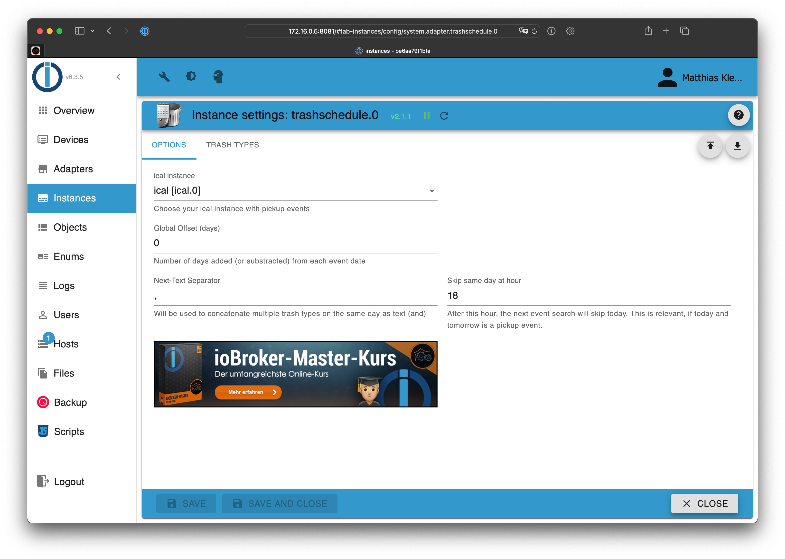
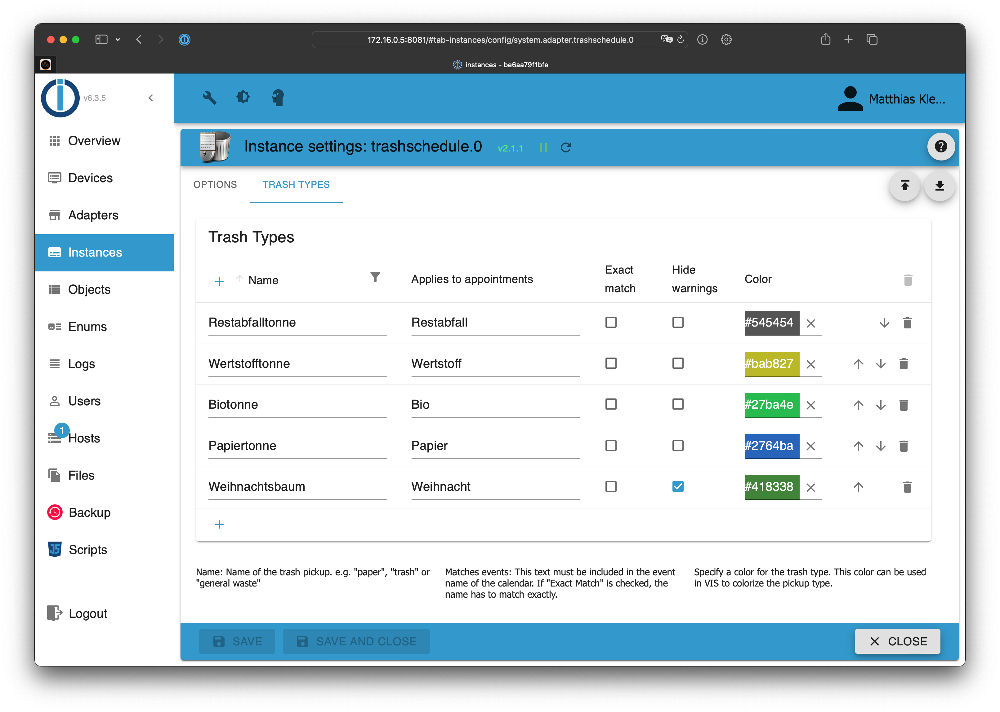
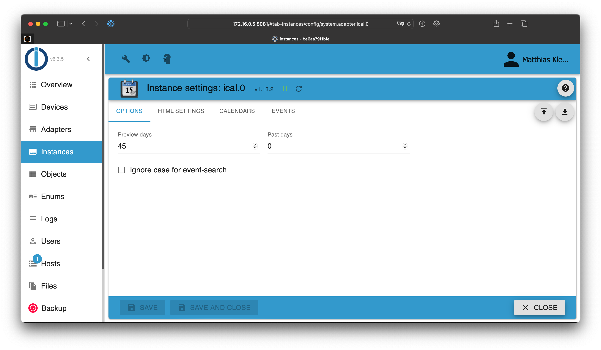

# ioBroker.trashschedule

## Table of contents

- [Providers](providers.md)
- [Blockly](blockly.md)
- [JavaScript](javascript.md)
- [FAQ](faq.md)

## Requirements

1. nodejs 18.0 (or later)
2. js-controller 5.0.0 (or later)
3. Admin Adapter 6.0.0 (or later)
4. iCal Adapter 1.12.1 (or later) - *optional*

## Configuration

1. Create a ```trashschedule``` instance and choose the ical instance as source. Alternatively, providers can be selected directly, which are integrated through various online services.
2. Go to the trash types tab and add as many types as you have trash types
3. Define a name for each new trash type and configure the matching events
4. Start the instance

**Questions?** Check the [FAQ](./faq.md)





## Preconditions for iCal

1. Create a new instance of the [ical adapter](https://github.com/iobroker-community-adapters/ioBroker.ical)
2. Configure the url of your calendar (e.g. google calendar)
3. Set "Preview days" to a range which includes every trash type at least twice (e.g. 45 days)
4. If you use the "events" tab, ensure to enable the "display" checkbox for each event type which should also be used in your trash schedule (otherwise the event will be hidden by the ical instance)



## VIS Widget (VIS version 1.x)


**VIS 2.x is not supported with this widget!**
